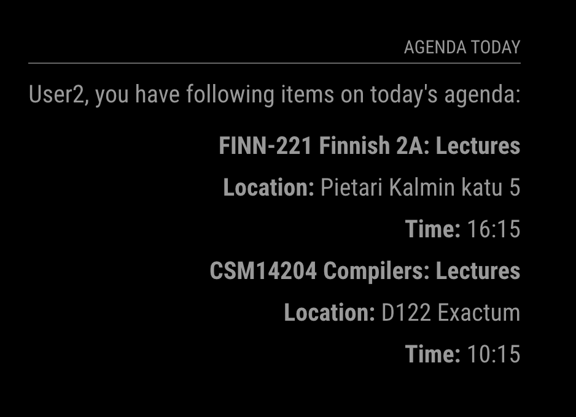
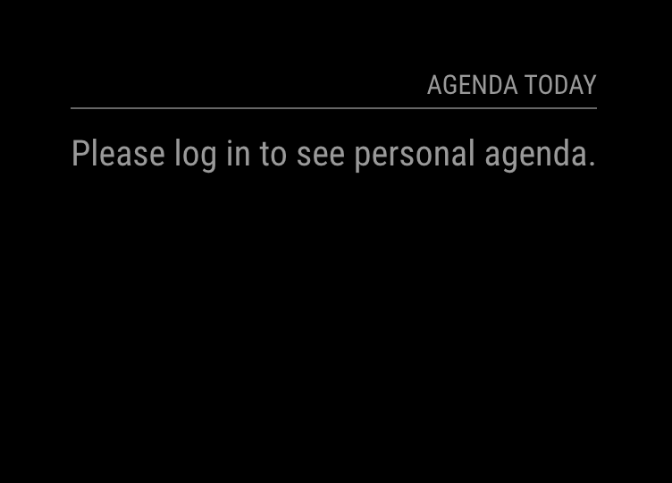

# MMM-personal-agenda

[toc]

This is a demo module for the [MagicMirror²](https://github.com/MichMich/MagicMirror/). It displays the agenda events of today of the user who is recognized by the face recognition module.

To-do:

- Fetch different agendas for different users
- Sort the agenda events by time on the interface

### Using the module

To use this module, add the following configuration block to the modules array in the `config/config.js` file:

```js
var config = {
    modules: [
        {
            module: 'personal_agenda',
            position: "top_right",
            header: "Agenda Today"
        }
    ]
}
```

### Introduction

This module is part of a group project in the course Cloud and Edge Computing.

The whole project is a MagicMirror-based system integrated with face recognition. This module is a part of it. This module started on [roramirez/MagicMirror-Module-Template](https://github.com/roramirez/MagicMirror-Module-Template).

At start, the face recognition module sends the recognized person ID to the MagicMirror, then the main system sends a global notification with the person ID as the payload. This module listens to the notification by function `notificationReceived()`, and then try to fetch the corresponding agenda.

As agreed, the ID can be four integers from 1 to 4. The corresponding usernames for each ID are hard-coded in the `node_helper.js` file. 

In the current stage, the module will try to fetch a curriculum exported as `.ical`, and displays the class name, time, and position (if it exists) of today.  

For demonstration purpose, the agenda API (i.e., the `.ical` link) is now hard-coded, which means it returns the same agenda for all users.  

### Quick test
To quickly test the module, you can put the following function into the `start()` function in a default module, such as `compliments.js`:

```js
setInterval(function () {
    var randomId = Math.floor(Math.random() * 4) + 1;
    self.sendNotification("PERSON_RECOGNIZED", {
        personId: randomId
    });
}, 5000);
```

This function will send a notification with a random ID from `[1-4]` every 5,000 ms.

### Examples of the output is shown below:
<!-- image example -->


The screenshot below shows the interface without a valid ID.


### Contribution

Some of other parts of the system are shown below:
- Face recognition component: [Linzh7/FaceRecognition-MagicMirror](https://github.com/Linzh7/FaceRecognition-MagicMirror)
- Transport information module: [qubelka/MMM-transport](https://github.com/qubelka/MMM-transport)
- And also the greatest contribution to this project which was from Kalle. 
