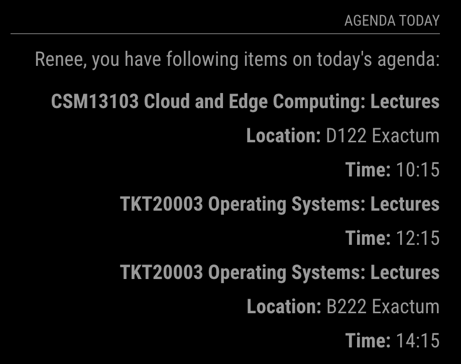

# MMM-personal-agenda

This is a demo module for the [MagicMirror²](https://github.com/MichMich/MagicMirror/).

Todo:
 - Configure the authtication API to receive the recognized person

## Using the module

To use this module, add the following configuration block to the modules array in the `config/config.js` file:
```js
var config = {
    modules: [
        {
            module: 'personal_agenda',
            position: "top_right",
            sheader: "Agenda Today"
        }
    ]
}
```
In the current stage, the module will try to fetch a curriculum exported as `.ical`, and displays the class name, time, and position (if it exists) of today.  

Now the authentication API is mocked as returning a random firstname as ID, which is supposed to be an integer. 

For demonstration purpose, the agenda API (i.e., the `.ical` link) is now hard-coded, which means it returns the same content for all users. For the same reason this repo is only available for internal users.

**An example of the output is shown below:**
<!-- image example -->
